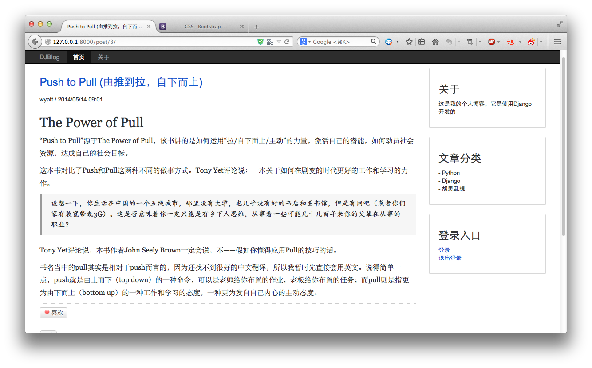

Markdown 与自订义tag
====

Django 1.4以前自带有`django.contrib.markup`的模块，支持Markdown语法的，1.6以后，就减掉了这个模块，如果在博客中使用的话，需要自己处理一下。

我们这里以一个Tag的方式来解析文章内容。

## 安装Markdown2

```bash
$ pip install markdown2
```

## 编写Tag
自定义Tag的位置有两种方式，一是作为一个单独的应用存在，二是直接放在某个应用的目录下。但无论哪种方式，所有的应用，都可以调用到。我们这里只有一个应用，那么我们就放在`blog`这个应用里面，目录是这样的：

```bash
tree blog/
blog/
├── ...

├── templatetags
│   ├── __init__.py
│   └── markup.py
```

即，在`blog`目录中新建一个`templatetags`目录，其中`__init__.py`这个文件是必须的，另一个文件，就是我们用来编写tag的文件了。代码如下：

```python
from django import template
from django.conf import settings
from django.utils.encoding import force_text, force_unicode
from django.utils.safestring import mark_safe
from django.template.defaultfilters import stringfilter

register = template.Library()

@register.filter(is_safe=True)
@stringfilter
def markdown2(value):
    try:
        import markdown2
    except ImportError:
        if settings.DEBUG:
            raise template.TemplateSyntaxError("Error in 'markdonw' filter: The Python markdown2 library isn't install.")
        return force_text(value)
    else:
        return mark_safe(markdown2.markdown(force_unicode(value),
                                            safe_mode=True,
                                            extras=["code-friendly",]))
```

## 在模板中使用

使用tag的方式与我们平时使用的一般Tag类似，由于是我们自订义的，所以在使用之前，需要`load`一下，在这个博客应用中，我们只需要在`_post.html`中载入并加入tag即可：

```

<div class="post">
  <h3><a href="{{ post.get_absolute_url }}">{{ post.title }}</a></h3>
  <div class="info">{{ post.author.username }} / {{ post.pub_data|date:"Y/m/d H:i" }}</div>
  <div class="content">{{ post.content|markdown2 }}</div>
</div>
```

使用这个tag之后，再适当设置下CSS样式，我们就能得到一个比较美观的内容显示页面了：



`main.css`这个CSS文件，你可以在这里下载到：

> <https://github.com/wwq0327/djwebapp-blog/blob/master/djblog/static/css/main.css>

对于自订定tag，到底是放在某个应用中，还是作为一个单独的应用，你可以根据自己的需要来安排，如果这个tag只在某个应用中使用，那么，你就可以将其放在这个应里目录下面，如果是一个公用的，那么你可以单独做一个应用，然后在里编写就行了。
