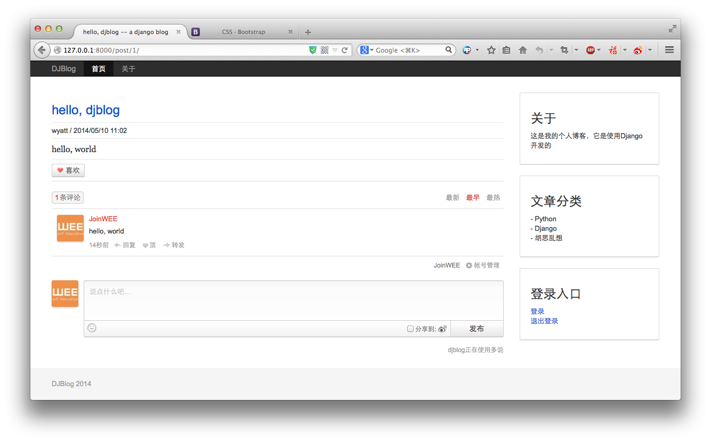

文章分类及侧边栏
====

通过前面的操作，我们的博客已具备了内容的添加与展示了，但离一个可以使用成品还是有段距离的，下面我们为博客添加侧边栏，页面，讨论等功能。

## 文章分类
这个分类，我们添加到`blog.models`中：

```python
class Category(models.Model):
    name = models.CharField(u'文章分类', max_length=64)

    class Meta:
        ordering = ['-id']

    def __unicode__(self):
        return self.name

```

这`Category`关联到`Post`中：

```python
	...
    po_type = models.ForeignKey(Category, verbose_name=u'文章分类', blank=True, null=True)
	...
```

使用south同步数据

```python
$ ./manage.py schemamigration blog --auto
 + Added model blog.Category
 + Added field po_type on blog.Post
Created 0002_auto__add_category__add_field_post_po_type.py. You can now apply this migration with: ./manage.py migrate blog

$ ./manage.py migrate blog
Running migrations for blog:
 - Migrating forwards to 0002_auto__add_category__add_field_post_po_type.
 > blog:0002_auto__add_category__add_field_post_po_type
 - Loading initial data for blog.
Installed 0 object(s) from 0 fixture(s)

```

同样，我们需要将`Category`也注册到Admin中，操作方法与`Post`类似：

```
# ...
from blog.models import Category
# ...
admin.site.register(Category)
```

完成这一步之后，我们就能在`admin`后台添加分类，并将文章归入相应的分类了。

## 侧边栏
我们平时看到的博客，一般侧边栏会放一些个人个信息，文章分类列表，一个登录入口之类的。所有页面的侧边栏都一样的，我们现在两个`views`，一个是首页的文章列表，一个是文章详细内容。于是我们可以考虑将这部份内容抽取出来，然后使用Django模块的`include`，引入到需要的模块中去。下面是我们的侧边栏代码：

```html
<div class="panel panel-default">
  <div class="panel-body">
    <h3>关于</h3>
    <p>这是我的个人博客，它是使用Django开发的</p>
 </div>
</div>

<div class="panel panel-default">
  <div class="panel-body">
    <h3>文章分类</h3>
    
    <ul class="list-unstyled">
    
      <li>- {{ c.name }}</li>
    
    </ul>
    
</div>
</div>

<div class="panel panel-default">
  <div class="panel-body">
    <h3>登录入口</h3>
    <p>
      <a href="/admin">登录</a><br />
      <a href="/admin/logout">退出登录</a>
    </p>
</div>
</div>

```

内容写好之后，我们需要在`blog/index.html`有`blog/post.html`引入一下：

```html



```

如你看到的，我们需要在`views`中添加上分类的查询：

```python
...
from blog.models import Post, Category

...

	categories = Category.objects.all()
...
	return render_to_response("blog/index.html",
				  {"posts": posts,
				   "categories": categories
				   },
				  context_instance=RequestContext(request))
```

`blog.views.index`和`blog.views.post`修改代码都是一样的，具体代码，请看这里：

<https://github.com/wwq0327/djwebapp-blog/blob/master/djblog/blog/views.py>

## 使用多说插件

多说评论是一个不错的评论插件，尽管Django自带一个评论模块，但一个社会化的评论更适合于我们，也为我们开发省下不少的事。

安装这个插件，你首先需要到[多说](http://duoshuo.com/)注册一个帐号，然点击“我要安装”，填写相关信息，最后你会得到安装代码，把代码复制到`blog/post.html`中的``下面。

复制之后，就能正常显示出来，但代码中有三个位置，我们仍然需要修改一下，即`id`，`标题`，`链接`，我们修改如下：

```html

<!-- 多说评论框 start -->
	<div class="ds-thread" data-thread-key="{{ post.id }}" data-title="{{ post.title }}" data-url="{{ post.get_absolute_url }}"></div>
<!-- 多说评论框 end -->

```

效果是这样的：



## 分类检索功能
上面我们只是显示出了文件的分类，但没并有添加分类的功能，我们希望在点击某个分类之后，把该分类中的所有文章都显示出来。

### 第一步：添加一个分类的URL

在`blog/urls.py`中添加上分类的URL：

```python
  url(r"^category/(?P<pk>\d+)/$", "blog.views.category", name="category"),
```
通过ID进行匹配，指定名称为`category`，这个在我们的第二步中需要用到。

### 第二步：给`Category`添加一个`get_absolute_url`方法

这个主要是方便我们在模块中直接调用分类的链接，而不用我们手工硬写，代码是：

```python
    @models.permalink
    def get_absolute_url(self):
        return ('category', (), {'pk': self.pk})
```

### 第三步：编写分类的相应处理函数

我们在`blog/views.py`中追加一个处理URL的函数：

```python
def category(request, pk):
  """相应分类下的文章检索"""

  try:
    cate = Category.objects.get(pk=pk)
  except Category.DoesNotExist:  ## 读取分类，如果不存在，则引发错误，并404
    raise Http404

  posts = cate.post_set.all() ## 获取分类下的所有文章
  return render_to_response('blog/index.html', ## 使用首页的文章列表模版，但加入了的一个`is_category`开关
    {"posts": posts,
    "is_category": True,
    "cate_name": cate.name,
    "categories": Category.objects.all()},
    context_instance=RequestContext(request))
```
检索分类的时候，我们作了一个小小的检查，如果分类存在，则正常显示，否则给出一个404错误。使用了`Http404`，因而需要导入这个包:

> from django.http import Http404

大致功能是：

- 读取分类
- 检索分类中的文章

这里我们没有写一个单独的分类模版，而是直接使用了`index.html`这个模版，因为他们都是显示文章及内容的，而对于分类模版来说，无非就是要多显示一个分类的提示，因而必有必要再写一个单独的模版，而只需要修改一下模版就成了。如何判断呢，我们给模版传递了一个`is_category`的Bool类型参数并且值为真。

同样，由于侧边栏需要读取所有分类，所以照样要传递一个`categories`的参数。

### 编写模版
调出`blog/index.html`这个模块文件，我们只需要改动两个地方就成了：

```html

“{{ cate_name|safe }}”文章列表首页


<div class="well well-sm">
  “{{ cate_name|safe }}”分类中共有
  <span class="label label-info">{{ posts|length}}</span>篇：
</div>









```

两处，一处为`title`，一处添加一个分类的进示框。

最后，我们需要修改一下侧边栏，即`blog/_side.html`这个模版，把分类的模块加上去，将

```
<li>- {{ c.name|safe }}</li>
```

改成：

```
<li>- <a href="{{ c.get_absolute_url }}">{{ c.name|safe }}</a></li>
```

然后，当然点击相应分类的时候，就可以看到该分类下的所有内容了:


如图中红框所示，同时，浏览器的标题栏也发生相应的变化。


